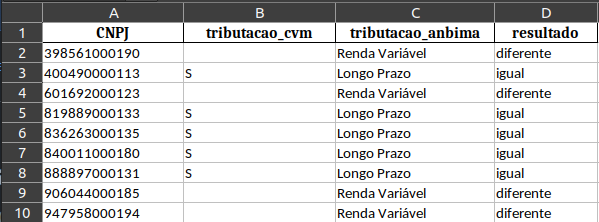

# Comparando a tributação de duas bases de investimento.

### Desafio: 
Desenvolver um código em python, que compara duas bases de fundos de investimento em excel, verificando se existem diferenças entre esses dados nos campos de tributação.

## Input:
- Dados de fundos da CVM: data/fundos_cvm.xlsx
- Dados de fundos da Anbima: data/fundos_anbima.xlsx

## Output esperado:
- Um excel, que descreve se existe divergências entre os campos  de  tributação das bases da CVM e Anbima. Apenas em fundos que estão presentes nas duas bases.

## Observações:
- Chave em comum das duas bases: id_fundo
- Chave id_fundo tem caracteres especiais e zeros no começo do id, que devem serem removidos para formar o numero de seu ID.
- Comparar as colunas de tributação de ambas as bases: TRIB_LPRAZO(base cvm) com a tributacao_alvo(base anbima).
- Criar uma coluna chamada ‘Resultado’, na qual descreve se a tributação das bases estão iguais ou não.
- Se o fundo(id_fundo) só estiver presente em apenas uma das bases, pode exclui-lo.
- Casos em que os campos das bases são iguais:
    | TRIB_LPRAZO(CVM) | tributacai_alvo(ANBIMA) |
    | :--- | ---: |
    | S | Longo Prazo |
    | N/A | Não Aplicável |
    | 'vazio' | Indefinido |
    
    Os demais casos, considere que os campos são diferentes.
    
### Amostra dos 10 primeiros resultados gerados:

